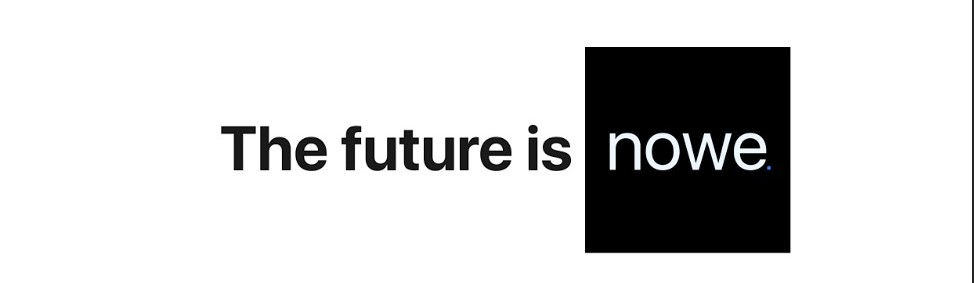

# Nesse repositório você encontra:
- [Nowe](https//:nowecompany.com.br) uma empresa fictícia criada para o TCC do curso de informática do colégio bento quirino, essa empresa tem como objetivo vender softwares de gestão e logística. 

- [Weon](https//:nowecompany.com.br/weon) um software web oferecido pela nowe para fazer a gestão e logística de documentos.

## Login para visitantes 
- Email: visitante@nowe.com
- Senha: 123456

## Progresso - (Weon)
- [x] Login
- [x] Cadastro de predefinições
- [x] Adição de campos
- [x] Cadastro de documentos 
- [ ] Lixeira
- [ ] Histótico
- [ ] Gerenciamento de usuário
- [ ] Dashboard
## Grupo
* [Moyseys](https://github.com/Moyseys) - Dev FullStack
* [Geovani Orsoli](https://github.com/geovaniorsoli) - Dev FrontEnd
* [Eduardo Ferreira](https://github.com/paderao) - Auxiliar BackEnd
* [Pedro Scomparim](https://github.com/pedroka3) - Auxiliar BackEnd
* [Felipe](https://github.com/palmaazx) - Gestor de diagramas
* [Murilo Silva](https://github.com/Silvalindo) - Coordenador e responsável pela documentação 

